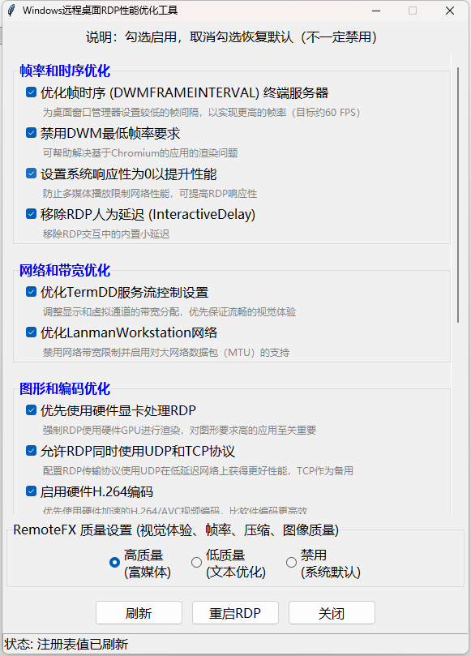

# RDP性能优化工具 (RDP Optimizer)

> 一个基于Python的图形化界面工具，用于优化Microsoft远程桌面协议(RDP)的性能和视觉体验。
>
> 本项目是 [fstanis/RDP-Tweaks](https://github.com/fstanis/RDP-Tweaks) 的中文优化版本，提供了更友好的用户界面和更详细的配置说明。



## 📋 项目特色

- **中文界面**：完全本地化的中文用户界面
- **分类管理**：按功能分类的优化选项，便于理解和使用
- **详细说明**：每个配置项都有详细的功能描述
- **一键操作**：图形化界面，无需手动编辑注册表
- **安全可靠**：提供设置恢复功能，避免系统损坏

## 🚀 功能特性

### 帧率和时序优化
- **优化帧时序 (DWMFRAMEINTERVAL)**：为桌面窗口管理器设置较低的帧间隔，实现更高帧率（目标约60 FPS）
- **禁用DWM最低帧率要求**：帮助解决基于Chromium的应用渲染问题
- **设置系统响应性为0**：防止多媒体播放限制网络性能，提高RDP响应性
- **移除RDP人为延迟**：移除RDP交互中的内置小延迟

### 网络和带宽优化
- **优化TermDD服务流控制**：调整显示和虚拟通道的带宽分配，优先保证流畅视觉体验
- **优化LanmanWorkstation网络**：禁用网络带宽限制，支持大网络数据包(MTU)

### 图形和编码优化
- **优先使用硬件显卡**：强制RDP使用硬件GPU进行渲染，对图形要求高的应用至关重要
- **允许RDP同时使用UDP和TCP**：配置RDP传输协议使用UDP在低延迟网络上获得更好性能
- **启用硬件H.264编码**：优先使用硬件加速的H.264/AVC视频编码，比软件编码更高效
- **优先使用H.264/AVC 444图形模式**：启用最高质量的H.264模式，实现像素级色彩精度
- **使用XDDM驱动替代WDDM**：禁用Windows显示驱动模型(WDDM)，使用较旧的Windows 2000显示驱动模型(XDDM)
- **关闭桌面合成**：即使客户端请求也禁用桌面合成，提高性能
- **关闭字体平滑**：为远程会话禁用字体平滑，解决文本渲染问题

### RemoteFX高级功能
- **启用RemoteFX虚拟化图形**：启用RemoteFX图形虚拟化功能
- **启用RemoteFX图形配置文件**：优化图形渲染性能
- **启用RemoteFX高级远程应用**：提升远程应用的图形体验

### RemoteFX质量预设
- **高质量**：针对快速连接优化，减少各种压缩设置到最小压缩
- **低质量**：针对次优连接优化，增加各种压缩设置到最大压缩
- **禁用**：恢复为系统默认设置

## 🛠️ 安装要求

### 系统要求
- Windows 10/11 或 Windows Server 2016+
- Python 3.6 或更高版本
- 管理员权限（必需）

## 📥 使用方法


### 1. 运行程序
```bash
# 以管理员身份运行
python rdp_optimizer.py
```
或者自行打包

```bash
pip install nuitka
python -m nuitka --standalone --onefile --remove-output --enable-plugin=tk-inter --windows-console-mode=disable --windows-icon-from-ico=远程桌面.ico rdp_optimizer.py
```

### 2. 配置优化
1. 程序启动后，界面将显示所有可用的优化选项
2. 勾选您想要启用的优化功能
3. 选择RemoteFX质量预设（高质量/低质量/禁用）
4. 点击"刷新"按钮检查当前状态
5. 点击"重启RDP"应用更改

## 🎯 界面说明

### 主界面布局
- **顶部**：程序标题和简要说明
- **中部**：按功能分类的优化选项（蓝色分类标题）
- **底部**：RemoteFX质量预设和操作按钮

### 操作按钮
- **刷新**：重新检查所有注册表设置的状态
- **重启RDP**：重启TermService服务以应用更改
- **关闭**：退出程序

## ⚠️ 注意事项

### 重要提醒
1. **管理员权限**：必须使用管理员权限运行，否则无法修改注册表
2. **备份重要数据**：修改注册表前建议备份系统或重要数据
3. **谨慎操作**：错误的注册表修改可能导致系统不稳定
4. **网络环境**：某些优化在网络条件较差时可能效果不明显

### 兼容性说明
- 本工具主要针对Windows 10/11和Windows Server 2016+优化
- 某些功能在较旧的Windows版本上可能不可用
- 硬件加速功能需要支持RemoteFX的显卡

## 🔧 技术实现

### 注册表修改
本工具通过修改以下注册表路径来优化RDP性能：
- `HKEY_LOCAL_MACHINE\SYSTEM\CurrentControlSet\Control\Terminal Server`
- `HKEY_LOCAL_MACHINE\SOFTWARE\Policies\Microsoft\Windows NT\Terminal Services`
- `HKEY_LOCAL_MACHINE\SYSTEM\CurrentControlSet\Services\TermDD`
- `HKEY_LOCAL_MACHINE\SYSTEM\CurrentControlSet\Services\LanmanWorkstation`

### 服务管理
- 自动停止和启动TermService服务
- 处理依赖服务的启动顺序

## 📊 性能提升

根据实际测试，启用优化后可以带来以下改进：
- **帧率提升**：从30FPS提升至60FPS
- **延迟降低**：减少50-100ms的交互延迟
- **图像质量**：改善文本和图形的渲染质量
- **网络效率**：提高带宽利用率


## 📄 许可证

本项目基于Apache 2.0许可证开源，详情请参阅 [LICENSE](LICENSE) 文件。

## 🙏 致谢

- 感谢 [fstanis/RDP-Tweaks](https://github.com/fstanis/RDP-Tweaks) 项目的启发
- 感谢所有贡献者和测试者
- 感谢开源社区的支持

**免责声明**: 本工具修改Windows注册表，使用风险自负。建议在生产环境使用前进行充分测试。